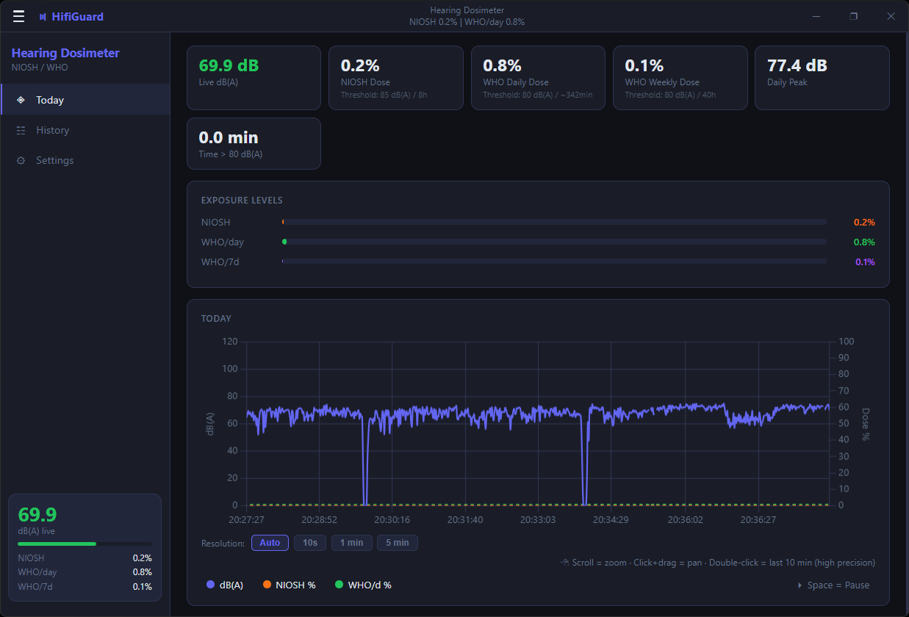
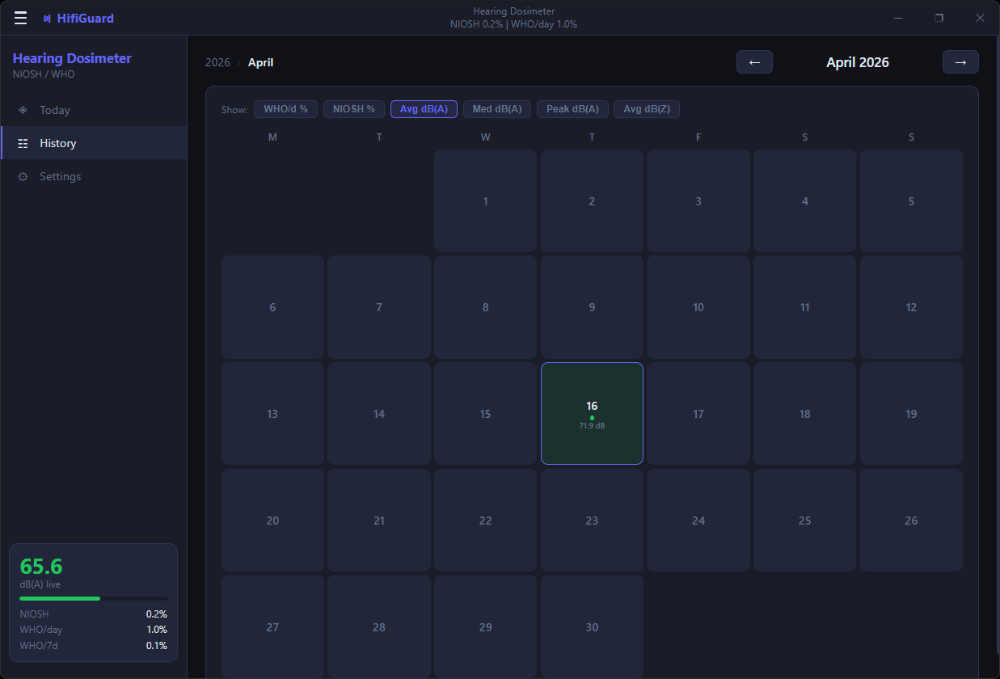
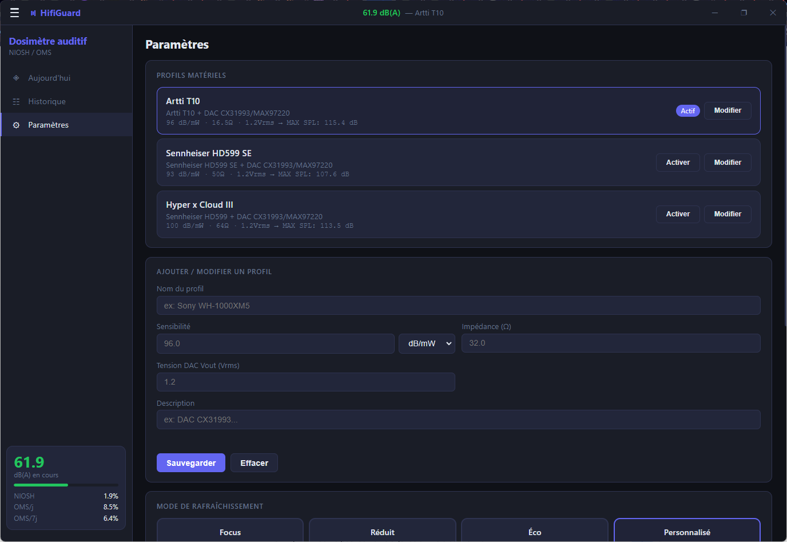
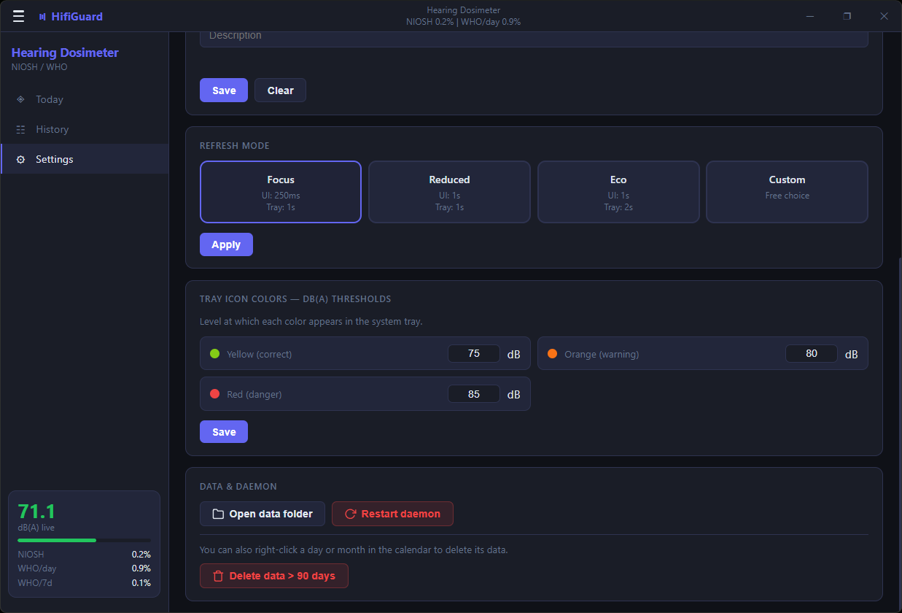
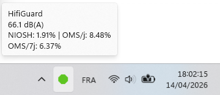

**Personal hearing dosimeter for headphones and earphones — Windows**

*Read this in other languages: [Français](README_FR.md).*

HifiGuard is a hearing dosimeter for Windows, built on Electron and Python, designed to monitor sound exposure when using headphones or earphones. The application intercepts the digital audio stream from the system via the WASAPI loopback interface and calculates, based on the hardware's electrical specifications, the theoretical sound pressure level (SPL) received at the ear.

The analysis engine applies A-weighting frequency filtering (IEC 61672-1 standard) to reflect the sensitivity of human hearing. It quantifies daily and weekly exposure against the NIOSH and WHO/ITU H.870 reference standards.

HifiGuard is natively compatible with system equalisation solutions such as [Equalizer APO](https://sourceforge.net/projects/equalizerapo/) and its [Peace GUI](https://sourceforge.net/projects/peace-equalizer-apo-extension/) interface, whose gain and filter modifications are integrated into its calculations.

> **Warning:** HifiGuard is a software estimation tool, not a certified hardware sound level meter. The results it provides are upper-bound approximations intended for personal prevention and cannot replace an acoustic measurement performed with a certified IEC 61672 instrument. For regulatory measurement, use an approved acoustic sound level meter.

-----

## Interface overview





<p align="center">
  
  
</p>

<p align="center">
  
</p>


## Features

- Real-time measurement of sound exposure in dB(A) and dB(Z)
- NIOSH and WHO/ITU H.870 dose tracking, daily and weekly
- Today graph with adjustable resolution (Auto / 10s / 1 min / 5 min)
- Double-click on the graph: last minute in high precision (measurements every 25 ms), updated continuously in the background even when minimised to tray
- Follow mode: when zoomed in and anchored to the right edge, the curve advances in real time
- Historical calendar: year → month → day view with curves, statistics, average and median
- Configurable secondary metric in the month view (WHO %, NIOSH %, average dB(A), median dB(A), peak dB(A), average dB(Z))
- Average and median calculated on measurements with sound only (silences excluded)
- Right-click on a day or month in the calendar to delete its data
- Colour-coded tray icon by level (green / yellow / orange / red)
- Compatible with Equalizer APO / Peace — the loopback capture accounts for applied software EQ
- Automatic daemon restart on audio device disconnection (up to 10 attempts)
- Launch at Windows startup
- French and English interface


## Installation

| Version   | File                                                                                                                            | Size   | Requirements             |
|-----------|---------------------------------------------------------------------------------------------------------------------------------|--------|--------------------------|
| Installer | [`HifiGuard Setup 1.0.0.exe`](https://github.com/ByronlLove/HifiGuard/releases/download/v1.0.0/HifiGuard%20Setup%201.0.0.exe)   | 125 MB | None — Python is bundled |
| Portable  | [`HifiGuard-1.0.0-portable.exe`](https://github.com/ByronlLove/HifiGuard/releases/download/v1.0.0/HifiGuard-1.0.0-portable.exe) | 123 MB | None — Python is bundled |


### First launch

1. Run the installer or the portable executable.
2. On first launch, choose your language.
3. Go to **Settings** and create a hardware profile for your headphones (see below).
4. The daemon starts automatically. The tray icon turns green when audio is detected.


## Hardware profile configuration

HifiGuard requires the electrical characteristics of your headphones to calculate the actual SPL received at the ear. These values are found in the manufacturer's datasheet or on independent measurement sites ([Rtings.com](https://www.rtings.com), [Oratory1990](https://www.reddit.com/r/oratory1990/wiki/index/), [Crinacle](https://crinacle.com)).

| Parameter                     | Description                                          | Example    |
|-------------------------------|------------------------------------------------------|------------|
| **Sensitivity**               | In dB/mW, mV/Pa, or dB/V, as listed on the datasheet | `96 dB/mW` |
| **Impedance**                 | In Ohms (Ω)                                          | `32 Ω`     |
| **DAC output voltage (Vout)** | RMS output voltage of your source (DAC / sound card) | `1.2 Vrms` |

The Vout of your DAC or sound card is found in its technical specifications. For a standard integrated sound card, a value of 1.0–1.5 Vrms is typical.

### Calculation formula

```
MAX_SPL = Sensitivity_dBmW + 10 × log10((Vout² / Impedance) × 1000)
SPL     = MAX_SPL + 20 × log10(RMS_signal) + Windows_Volume_dB
```

Sensitivity unit conversions applied internally:

```
mV/Pa  →  dB/mW :  124 − 20 × log10(raw) + 10 × log10(Ω)
dB/V   →  dB/mW :  raw − 10 × log10(1000 / Ω)
```


## Project structure

```
HifiGuard/
├── electron/           Main process (Electron)
│   ├── main.js
│   └── preload.js
├── ui/                 User interface (HTML / CSS / JS)
│   ├── index.html
│   └── renderer.js
├── daemon/             Python audio daemon
│   └── hifiguard.py
├── locales/            Interface translations
│   ├── en.json
│   └── fr.json
├── data/               Generated data — not committed
│   ├── config.json
│   ├── state.json
│   ├── suivi_audio.json
│   └── historique.csv
├── assets/             Icons and screenshots
├── build.bat           One-click Windows build script
└── package.json
```


## Limits and precision

HifiGuard measures the **digital signal** sent by Windows to your headphones. The measurements are **upper-bound approximations** — they correspond to the maximum theoretical level your headphones can produce, assuming your profile is correctly configured.

The calculation relies on the Windows audio architecture. Certain hardware or software configurations distort or block the measurements:

- **Analogue attenuation:** DACs or external amplifiers with a physical volume knob modify gain after the PC output. HifiGuard cannot read this hardware reduction. For accurate measurements, an external amplifier must be set to a fixed volume (e.g. 100%) and attenuation must be managed through Windows.

- **Mixer bypass (ASIO / WASAPI Exclusive):** Players configured for exclusive device control (Audirvana, Foobar2000 in exclusive mode) bypass the Windows audio layer. HifiGuard will display incorrect results.

- **Active headphones (internal DSP):** Bluetooth or USB headphones that apply their own correction profile internally may have a real output level that differs from the theoretical electrical calculation. The signal is processed inside the headphone (which has its own DAC, amplifier, and often an independent volume control). The software has no way to read the voltage of that internal amplifier or measure the impact of its digital processor on the final sound.


## Technical specifications

| Component            | Detail                                                                       |
|----------------------|------------------------------------------------------------------------------|
| Audio capture        | WASAPI loopback via `soundcard`                                              |
| Frequency weighting  | A-weighting, IEC 61672-1, implemented as IIR filter via `scipy.signal`       |
| Measurement interval | 25 ms audio block (configurable)                                             |
| CSV logging          | 1 line per second (peak of the elapsed second)                               |
| NIOSH standard       | 85 dB(A) criterion level, 8h criterion time, 3 dB exchange rate (NIOSH 1998) |
| WHO standard         | 80 dB(A), 342 min/day, 40h/week — ITU-T H.870                                |
| Interface            | Electron 28, Chart.js 4.4, chartjs-plugin-zoom                               |
| Daemon               | Python 3.10+, NumPy, SciPy, soundcard, pycaw                                 |
| Platform             | Windows 10 / 11 (x64)                                                        |


## Development

### Prerequisites

- [Node.js](https://nodejs.org) 18+
- [Python](https://www.python.org) 3.10+
- pip packages: `soundcard numpy scipy pycaw comtypes`

### Run in development mode

```bash
git clone https://github.com/ByronlLove/HifiGuard.git

# Install Node dependencies
npm install

# Install Python dependencies
pip install soundcard numpy scipy pycaw comtypes

# Start
npm start
```

Press **F12** to open the DevTools console.

### Build (installer + portable)

```bash
git clone https://github.com/ByronlLove/HifiGuard.git

# Windows — double-click build.bat
# or from the command line:

# 1. Create and activate a Python virtual environment
python -m venv venv
.\venv\Scripts\activate

# 2. Install Python dependencies
pip install pyinstaller soundcard numpy scipy pycaw comtypes

# 3. Compile the Python daemon into an .exe
python -m PyInstaller --onefile --noconsole --name hifiguard --distpath daemon/dist daemon/hifiguard.py --clean

# 4. Install Node dependencies and package the Electron app
npm install
npm run build
```

Output files are in `dist/`.

### Portable version

The portable executable produced by `build.bat` (`HifiGuard-x.x.x-portable.exe`) requires no installation. It can be run directly from any location. User data is stored in `%APPDATA%\HifiGuard\data\` by default.


## Frequently Asked Questions (FAQ)

**Why is the software described as an "upper-bound approximation"?**
HifiGuard is designed to prioritize your hearing safety by always retaining the maximum values. This is due to two technical choices:
1. **Peak aggregation:** The Python engine continuously analyzes the audio in micro-blocks (e.g., 25 milliseconds). When writing to the history log, instead of smoothing the measurement by averaging over a second, the algorithm retains only the maximum amplitude peak detected. Sudden, brief noises therefore carry more weight.
2. **Absolute digital volume:** The calculation assumes your amplifier outputs 100% of the Windows signal. If you reduce the volume using a physical knob on your DAC, the software ignores this and calculates the dose based on the digital volume, thereby overestimating your actual exposure.

**Why does the displayed dB level seem much louder than what I am hearing?**
This is almost always due to a unit error in the headphone sensitivity entered in the settings. Manufacturers or retailers often display a raw value (e.g., 106 dB) without specifying the reference unit, which leads to confusion.
*Concrete example:* The Sennheiser HD599 SE headphones are often listed at "106 dB". If you enter 106 into HifiGuard with the default unit (`dB/mW`), the software will massively overestimate the volume. In reality, Sennheiser expresses this value in `dB/V` (106 dB per 1 Volt RMS). For these headphones, 106 dB/V is equivalent to only **93 dB/mW**. A simple unit error can therefore skew your results by 12 to 13 dB. Always check the official manufacturer datasheets.

**Why is HifiGuard warning me when my Windows volume is only at 15%?**
The Windows volume is merely an attenuation percentage. If you use highly sensitive in-ear monitors (IEMs) (e.g., 115 dB/mW) plugged into a very powerful DAC (e.g., 2.0 Vrms), the sound level produced at 15% digital volume could already be physically dangerous to your ears. This highlights the core purpose of HifiGuard: translating an arbitrary digital percentage into actual sound pressure.

**Does the background application impact performance (gaming, audio production)?**
No. The Python daemon is optimized to be extremely lightweight. Although it captures the audio stream every 25 milliseconds by default to ensure no peaks are missed, it only writes to the hard drive (`.csv` file) once per second. Furthermore, it does not interfere with the audio stream: it simply "clones" it via the Windows loopback (WASAPI) without adding any latency.

**Does HifiGuard work with my wireless Bluetooth headphones?**
No. As explained in the *Limits and precision* section, Bluetooth headphones have their own internal amplifier and digital signal processor (DSP). Windows does not send an electrical signal to them, but rather digital data. HifiGuard therefore cannot apply its voltage and impedance calculations.


## Road map

- [ ] **Frequency Response Compensation:** Integration of specific frequency response curves for each headphone or earphone for an even more precise SPL calculation.
- [ ] **Visual Themes:** Support for "Ghost" and "Transparent" UI modes.
- [ ] **Data Optimization:** Split the historical CSV file by day.


## Credits

**ByronlLove** — Software architecture and audio analysis engine design, 
dosimetric calculation modeling, user experience (UI/UX) design, 
testing (QA), and deployment.

Source code and translations implemented with the assistance of Claude (Anthropic).

## License

AGPL-3.0 — see [LICENSE](LICENSE)


## Disclaimer

HifiGuard is provided for informational and personal prevention purposes only. The sound level estimates it produces are not medically certified measurements and do not constitute a substitute for professional audiological assessment or certified acoustic instrumentation. The authors accept no liability for hearing damage, loss, or any other harm arising from reliance on the data provided by this software. Use of this software is at the user's own risk.
